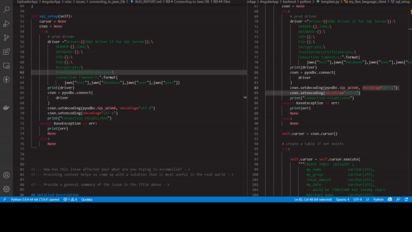

<!--- Provide a general summary of the issue in the Title above -->
# Connecting to Jaws DB 
## Expected Behavior

* Connectto Jaws DB issues
<!--- Tell us what should happen -->
* JawsDB should connect to the DB upon using the credentials provided


## Current Behavior
* Jaws fails to connect
<!--- Tell us what happens instead of the expected behavior -->

## Possible Solution
* provide resource other than ODBC, or django (were using tornado which acts as a backend not a frontend framework) that can help us connecy


<!--- Not obligatory, but suggest a fix/reason for the bug, -->

## Steps to Reproduce

<!--- Provide a link to a live example, or an unambiguous set of steps to -->
<!--- reproduce this bug. Include code to reproduce, if relevant -->
1. copy the script and run it 
2.
3.
4.

## Environment
|property|value|data|
|:------|:------:|------|
|Python| 3.9.6||
|Tornado|v.6.1||
|PyODBC|v4.0.30||
|ODBC|v10.0.1904.1||


## Files
<!-- paste snippets as well as upload files -->
__FILE backend.py__
```py
jaws = {
    "host":os.environ["JAWS_DB_SQL_HOST"],
    "user":os.environ["JAWS_DB_SQL_USER"],
    "pass":os.environ["JAWS_DB_SQL_PASS"],
    "database":os.environ["JAWS_DB_SQL_DATABASE"]
}

def sql_setup(self):
    cursor = None
    cnxn = None
    try:
        # prod driver
        driver ="Driver={{ODBC Driver 17 for SQL Server}};\
            SERVER={},3306;\
            DATABASE={};\
            UID={};\
            PID={};\
            Encrypt=yes;\
            TrustServerCertificate=yes;\
            Connection Timeout=5;".format(
                jaws["host"],jaws["database"],jaws["user"],jaws["pass"])
        print(driver)
        cnxn = pyodbc.connect(
            driver
        )
        cnxn.setdecoding(pyodbc.SQL_WCHAR, encoding='utf-8')
        cnxn.setencoding(encoding='utf-8')
        print("Connection established")
    except BaseException as err:
        print(err)
        None
    else:
        None 
```


<!--- How has this issue affected you? What are you trying to accomplish? -->
<!--- Providing context helps us come up with a solution that is most useful in the real world -->

<!--- Provide a general summary of the issue in the Title above -->

## Detailed Description
<!--- Provide a detailed description of the change or addition you are proposing -->

## Possible Implementation
<!--- Not obligatory, but suggest an idea for implementing addition or change -->
